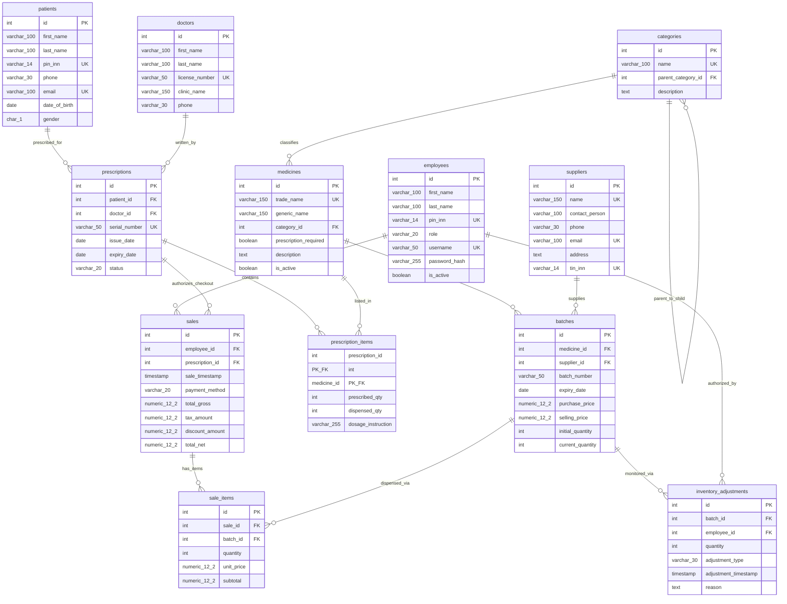

# ER-Model Specification: Small Pharmacy Inventory & Prescription System

This document provides a comprehensive, production-grade **Entity-Relationship (ER) Model Specification** for the Small Pharmacy Inventory & Prescription System designed for **COMP2082**. 

The specification details structural schemas, strict relational definitions, functional dependencies, normalization proofs, structural anomaly checks, standard DBML notation for `dbdiagram.io`, and a Mermaid ERD.

---

## 🗺️ 1. Full Database Schema Dictionary

The system is defined by **12 physical tables** engineered for PostgreSQL 15+. Every table represents a normalized entity containing specific domain constraints.

### 1.1 `categories`
Tracks hierarchical classification structures of medications (e.g., *Antibiotics* -> *Penicillins*).
- **Primary Key**: `id` (SERIAL)
- **Foreign Keys**:
  - `parent_category_id` references `categories(id) ON UPDATE CASCADE ON DELETE SET NULL`
- **CHECK Constraints**: None (handled by column structures)
- **UNIQUE Constraints**: `name`
- **Attributes**:
  | Name | Data Type | Nullable | Default | Description |
  | :--- | :--- | :--- | :--- | :--- |
  | `id` | INT | NOT NULL | *SERIAL* | Unique sequential Category ID |
  | `name` | VARCHAR(100) | NOT NULL | None | Name of the classification |
  | `parent_category_id` | INT | NULL | NULL | References parent Category (self-referencing) |
  | `description` | TEXT | NULL | NULL | General details about the classification |

---

### 1.2 `medicines`
Master register of abstract pharmaceutical entities.
- **Primary Key**: `id` (SERIAL)
- **Foreign Keys**:
  - `category_id` references `categories(id) ON UPDATE CASCADE ON DELETE RESTRICT`
- **CHECK Constraints**: None
- **UNIQUE Constraints**: `trade_name`
- **Attributes**:
  | Name | Data Type | Nullable | Default | Description |
  | :--- | :--- | :--- | :--- | :--- |
  | `id` | INT | NOT NULL | *SERIAL* | Unique sequential Medicine ID |
  | `trade_name` | VARCHAR(150) | NOT NULL | None | Commercial brand name |
  | `generic_name` | VARCHAR(150) | NOT NULL | None | Active chemical substance (INN generic name) |
  | `category_id` | INT | NOT NULL | None | Links to classifications directory |
  | `prescription_required` | BOOLEAN | NOT NULL | `FALSE` | Enforces prescription verification if TRUE |
  | `description` | TEXT | NULL | NULL | Therapeutic details or storage directives |
  | `is_active` | BOOLEAN | NOT NULL | `TRUE` | Soft-delete status flag |

---

### 1.3 `suppliers`
Wholesale drug distributors supplying stock.
- **Primary Key**: `id` (SERIAL)
- **Foreign Keys**: None
- **CHECK Constraints**:
  - `phone CHECK (phone ~ '^\+996\d{9}$')`
  - `tin_inn CHECK (tin_inn ~ '^[012]\d{13}$')`
- **UNIQUE Constraints**: `name`, `email`, `tin_inn`
- **Attributes**:
  | Name | Data Type | Nullable | Default | Description |
  | :--- | :--- | :--- | :--- | :--- |
  | `id` | INT | NOT NULL | *SERIAL* | Unique Supplier ID |
  | `name` | VARCHAR(150) | NOT NULL | None | Company registered name |
  | `contact_person` | VARCHAR(100) | NULL | NULL | Name of wholesale agent |
  | `phone` | VARCHAR(30) | NULL | NULL | Contact phone (+996 XXX XX-XX-XX) |
  | `email` | VARCHAR(100) | NULL | NULL | Corporate email |
  | `address` | TEXT | NULL | NULL | Office or warehouse address |
  | `tin_inn` | VARCHAR(14) | NOT NULL | None | 14-digit corporate tax INN (Kyrgyzstan) |

---

### 1.4 `patients`
Register of patients receiving prescriptions and purchasing drugs.
- **Primary Key**: `id` (SERIAL)
- **Foreign Keys**: None
- **CHECK Constraints**:
  - `phone CHECK (phone ~ '^\+996\d{9}$')`
  - `pin_inn CHECK (pin_inn ~ '^[12]\d{13}$')`
  - `date_of_birth CHECK (date_of_birth <= CURRENT_DATE)`
  - `gender CHECK (gender IN ('M', 'F'))`
- **UNIQUE Constraints**: `pin_inn`, `email`
- **Attributes**:
  | Name | Data Type | Nullable | Default | Description |
  | :--- | :--- | :--- | :--- | :--- |
  | `id` | INT | NOT NULL | *SERIAL* | Unique Patient ID |
  | `first_name` | VARCHAR(100) | NOT NULL | None | First name |
  | `last_name` | VARCHAR(100) | NOT NULL | None | Last name |
  | `pin_inn` | VARCHAR(14) | NOT NULL | None | Personal 14-digit ID PIN (ПИН/ИНН) |
  | `phone` | VARCHAR(30) | NULL | NULL | Contact phone |
  | `email` | VARCHAR(100) | NULL | NULL | Personal email address |
  | `date_of_birth` | DATE | NOT NULL | None | Date of birth |
  | `gender` | CHAR(1) | NOT NULL | None | Biological gender (M/F) |

---

### 1.5 `doctors`
Registered healthcare professionals authorized to issue prescriptions.
- **Primary Key**: `id` (SERIAL)
- **Foreign Keys**: None
- **CHECK Constraints**:
  - `phone CHECK (phone ~ '^\+996\d{9}$')`
- **UNIQUE Constraints**: `license_number`
- **Attributes**:
  | Name | Data Type | Nullable | Default | Description |
  | :--- | :--- | :--- | :--- | :--- |
  | `id` | INT | NOT NULL | *SERIAL* | Unique Doctor ID |
  | `first_name` | VARCHAR(100) | NOT NULL | None | First name |
  | `last_name` | VARCHAR(100) | NOT NULL | None | Last name |
  | `license_number` | VARCHAR(50) | NOT NULL | None | MoH-issued medical license number |
  | `clinic_name` | VARCHAR(150) | NOT NULL | None | Workplace hospital/clinic name |
  | `phone` | VARCHAR(30) | NULL | NULL | Contact phone |

---

### 1.6 `employees`
Pharmacy staff registers (pharmacists, managers, administrators).
- **Primary Key**: `id` (SERIAL)
- **Foreign Keys**: None
- **CHECK Constraints**:
  - `pin_inn CHECK (pin_inn ~ '^[12]\d{13}$')`
  - `role CHECK (role IN ('pharmacist', 'manager', 'admin'))`
- **UNIQUE Constraints**: `pin_inn`, `username`
- **Attributes**:
  | Name | Data Type | Nullable | Default | Description |
  | :--- | :--- | :--- | :--- | :--- |
  | `id` | INT | NOT NULL | *SERIAL* | Unique Employee ID |
  | `first_name` | VARCHAR(100) | NOT NULL | None | First name |
  | `last_name` | VARCHAR(100) | NOT NULL | None | Last name |
  | `pin_inn` | VARCHAR(14) | NOT NULL | None | 14-digit personal ID PIN |
  | `role` | VARCHAR(20) | NOT NULL | None | System permission tier |
  | `username` | VARCHAR(50) | NOT NULL | None | Login handle |
  | `password_hash` | VARCHAR(255) | NOT NULL | None | Secure hashed credentials |
  | `is_active` | BOOLEAN | NOT NULL | `TRUE` | Soft-delete active status flag |

---

### 1.7 `batches`
Active physical blocks of medicine in inventory.
- **Primary Key**: `id` (SERIAL)
- **Foreign Keys**:
  - `medicine_id` references `medicines(id) ON UPDATE CASCADE ON DELETE CASCADE`
  - `supplier_id` references `suppliers(id) ON UPDATE CASCADE ON DELETE RESTRICT`
- **CHECK Constraints**:
  - `purchase_price CHECK (purchase_price > 0)`
  - `selling_price CHECK (selling_price > purchase_price)` -- Assures gross profit margins
  - `initial_quantity CHECK (initial_quantity > 0)`
  - `current_quantity CHECK (current_quantity >= 0)`
- **UNIQUE Constraints**: `(medicine_id, batch_number)` -- Ensures batch serial numbers are distinct per product
- **Attributes**:
  | Name | Data Type | Nullable | Default | Description |
  | :--- | :--- | :--- | :--- | :--- |
  | `id` | INT | NOT NULL | *SERIAL* | Unique Batch ID |
  | `medicine_id` | INT | NOT NULL | None | Links to abstract medicine record |
  | `supplier_id` | INT | NOT NULL | None | Wholesale distributor of this block |
  | `batch_number` | VARCHAR(50) | NOT NULL | None | Physical batch label on drug packaging |
  | `expiry_date` | DATE | NOT NULL | None | Expiry schedule date |
  | `purchase_price` | NUMERIC(12,2) | NOT NULL | None | Wholesale buy cost per unit (KGS) |
  | `selling_price` | NUMERIC(12,2) | NOT NULL | None | Retail sell price per unit (KGS) |
  | `initial_quantity` | INT | NOT NULL | None | Intake quantity received |
  | `current_quantity` | INT | NOT NULL | None | Remaining physical stock in inventory |

---

### 1.8 `prescriptions`
Prescriptions registered in the system.
- **Primary Key**: `id` (SERIAL)
- **Foreign Keys**:
  - `patient_id` references `patients(id) ON UPDATE CASCADE ON DELETE RESTRICT`
  - `doctor_id` references `doctors(id) ON UPDATE CASCADE ON DELETE RESTRICT`
- **CHECK Constraints**:
  - `expiry_date CHECK (expiry_date >= issue_date)`
  - `status CHECK (status IN ('pending', 'partially_filled', 'filled', 'expired'))`
- **UNIQUE Constraints**: `serial_number`
- **Attributes**:
  | Name | Data Type | Nullable | Default | Description |
  | :--- | :--- | :--- | :--- | :--- |
  | `id` | INT | NOT NULL | *SERIAL* | Unique Prescription ID |
  | `patient_id` | INT | NOT NULL | None | Recipient patient |
  | `doctor_id` | INT | NOT NULL | None | Authorizing doctor |
  | `serial_number` | VARCHAR(50) | NOT NULL | None | QR or unique index on slip |
  | `issue_date` | DATE | NOT NULL | *CURRENT_DATE* | Date issued |
  | `expiry_date` | DATE | NOT NULL | None | Last date valid for dispensing |
  | `status` | VARCHAR(20) | NOT NULL | `'pending'` | Cumulative fulfillment state |

---

### 1.9 `prescription_items`
Junction table for prescriptions and medicines (M:N).
- **Primary Key**: `(prescription_id, medicine_id)`
- **Foreign Keys**:
  - `prescription_id` references `prescriptions(id) ON UPDATE CASCADE ON DELETE CASCADE`
  - `medicine_id` references `medicines(id) ON UPDATE CASCADE ON DELETE RESTRICT`
- **CHECK Constraints**:
  - `prescribed_qty CHECK (prescribed_qty > 0)`
  - `dispensed_qty CHECK (dispensed_qty >= 0 AND dispensed_qty <= prescribed_qty)`
- **UNIQUE Constraints**: None (Covered by composite Primary Key)
- **Attributes**:
  | Name | Data Type | Nullable | Default | Description |
  | :--- | :--- | :--- | :--- | :--- |
  | `prescription_id` | INT | NOT NULL | None | Parent prescription record |
  | `medicine_id` | INT | NOT NULL | None | Authorized medicine |
  | `prescribed_qty` | INT | NOT NULL | None | Total authorized count |
  | `dispensed_qty` | INT | NOT NULL | `0` | Quantity currently checked out |
  | `dosage_instruction` | VARCHAR(255) | NOT NULL | None | Usage intervals (e.g. "Take 1 tab bid") |

---

### 1.10 `sales`
Financial sale headers logging transaction details.
- **Primary Key**: `id` (SERIAL)
- **Foreign Keys**:
  - `employee_id` references `employees(id) ON UPDATE CASCADE ON DELETE RESTRICT`
  - `prescription_id` references `prescriptions(id) ON UPDATE CASCADE ON DELETE RESTRICT`
- **CHECK Constraints**:
  - `payment_method CHECK (payment_method IN ('cash', 'card', 'mobile_qr'))`
  - `total_gross CHECK (total_gross >= 0)`
  - `tax_amount CHECK (tax_amount >= 0)`
  - `discount_amount CHECK (discount_amount >= 0)`
  - `total_net CHECK (total_net >= 0)`
- **UNIQUE Constraints**: None
- **Attributes**:
  | Name | Data Type | Nullable | Default | Description |
  | :--- | :--- | :--- | :--- | :--- |
  | `id` | INT | NOT NULL | *SERIAL* | Unique Transaction Sale ID |
  | `employee_id` | INT | NOT NULL | None | Pharmacist processing checkout |
  | `prescription_id` | INT | NULL | NULL | Linked prescription (nullable for OTC) |
  | `sale_timestamp` | TIMESTAMP | NOT NULL | *CURRENT_TIMESTAMP* | Date and time of sale |
  | `payment_method` | VARCHAR(20) | NOT NULL | None | Retail payment channel |
  | `total_gross` | NUMERIC(12,2) | NOT NULL | `0.00` | Sum of item subtotals (KGS) |
  | `tax_amount` | NUMERIC(12,2) | NOT NULL | `0.00` | Included 12% standard Kyrgyz VAT |
  | `discount_amount` | NUMERIC(12,2) | NOT NULL | `0.00` | Applied loyalty/coupon deductions |
  | `total_net` | NUMERIC(12,2) | NOT NULL | `0.00` | Final paid value (Gross - Discount) |

---

### 1.11 `sale_items`
Junction table mapping individual item checkout items in a sale (M:N).
- **Primary Key**: `id` (SERIAL)
- **Foreign Keys**:
  - `sale_id` references `sales(id) ON UPDATE CASCADE ON DELETE CASCADE`
  - `batch_id` references `batches(id) ON UPDATE CASCADE ON DELETE RESTRICT`
- **CHECK Constraints**:
  - `quantity CHECK (quantity > 0)`
  - `unit_price CHECK (unit_price > 0)`
  - `subtotal CHECK (subtotal > 0)`
- **UNIQUE Constraints**: `(sale_id, batch_id)` -- Prevents duplicate batch items per sale invoice
- **Attributes**:
  | Name | Data Type | Nullable | Default | Description |
  | :--- | :--- | :--- | :--- | :--- |
  | `id` | INT | NOT NULL | *SERIAL* | Unique Sale Item Row ID |
  | `sale_id` | INT | NOT NULL | None | Link to sales receipt header |
  | `batch_id` | INT | NOT NULL | None | Specific inventory batch dispensed |
  | `quantity` | INT | NOT NULL | None | Quantity purchased |
  | `unit_price` | NUMERIC(12,2) | NOT NULL | None | Price per item (auto-copied from Batch) |
  | `subtotal` | NUMERIC(12,2) | NOT NULL | None | calculated row cost (Price * Qty) |

---

### 1.12 `inventory_adjustments`
Log documenting physical stock deviations (shrinkage, damage, breakage).
- **Primary Key**: `id` (SERIAL)
- **Foreign Keys**:
  - `batch_id` references `batches(id) ON UPDATE CASCADE ON DELETE CASCADE`
  - `employee_id` references `employees(id) ON UPDATE CASCADE ON DELETE RESTRICT`
- **CHECK Constraints**:
  - `adjustment_type CHECK (adjustment_type IN ('breakage', 'spoilage', 'theft', 'reconciliation', 'return_to_supplier'))`
- **UNIQUE Constraints**: None
- **Attributes**:
  | Name | Data Type | Nullable | Default | Description |
  | :--- | :--- | :--- | :--- | :--- |
  | `id` | INT | NOT NULL | *SERIAL* | Unique Adjustment ID |
  | `batch_id` | INT | NOT NULL | None | Affected stock batch |
  | `employee_id` | INT | NOT NULL | None | Staff member performing correction |
  | `quantity` | INT | NOT NULL | None | Quantity delta (negative for losses) |
  | `adjustment_type` | VARCHAR(30) | NOT NULL | None | Classification of correction |
  | `adjustment_timestamp` | TIMESTAMP | NOT NULL | *CURRENT_TIMESTAMP* | Audit execution timeline |
  | `reason` | TEXT | NOT NULL | None | Comprehensive textual details |

---

## 🔗 2. Relationships & Cardinalities

The system leverages standard relational cardinality notations (one-to-one, one-to-many, many-to-many):

```
[categories] 1 <─────────── recursion ───────────> 0..N [categories]
[categories] 1 <─────────────────────────────────> 0..N [medicines]
[medicines]  1 <─────────────────────────────────> 0..N [batches]
[suppliers]  1 <─────────────────────────────────> 0..N [batches]
[patients]   1 <─────────────────────────────────> 0..N [prescriptions]
[doctors]    1 <─────────────────────────────────> 0..N [prescriptions]
[employees]  1 <─────────────────────────────────> 0..N [sales]
[employees]  1 <─────────────────────────────────> 0..N [inventory_adjustments]
[batches]    1 <─────────────────────────────────> 0..N [inventory_adjustments]
[batches]    1 <─────────────────────────────────> 0..N [sale_items]
[sales]      1 <─────────────────────────────────> 0..N [sale_items]

[prescriptions] 0..1 <───────── optional ─────────> 0..N [sales]
```

### 2.1 One-to-Many ($1 \rightarrow N$) Relationships
- **`categories` $\rightarrow$ `categories`**: A parent category classifies $0$ or $N$ child sub-categories. An individual sub-category links back to at most $1$ parent category (Optional, $0..1$).
- **`categories` $\rightarrow$ `medicines`**: A category classifies $0$ or $N$ medicines. Each medicine must map to exactly $1$ category.
- **`medicines` $\rightarrow$ `batches`**: A medicine catalogue record holds $0$ or $N$ active inventory batches. Each batch is tied to exactly $1$ parent medicine.
- **`suppliers` $\rightarrow$ `batches`**: A wholesale distributor supplies $0$ or $N$ batches of drugs. A batch maps to exactly $1$ supplier.
- **`patients` $\rightarrow$ `prescriptions`**: A registered patient receives $0$ or $N$ prescriptions over time. A prescription is written for exactly $1$ patient.
- **`doctors` $\rightarrow$ `prescriptions`**: A clinical doctor authorizes $0$ or $N$ prescriptions. A prescription is authorized by exactly $1$ doctor.
- **`employees` $\rightarrow$ `sales`**: A cashier/pharmacist processes $0$ or $N$ transaction sales. A sale is checked out by exactly $1$ employee.
- **`employees` $\rightarrow$ `inventory_adjustments`**: An employee logs $0$ or $N$ audit adjustments. An adjustment record points to exactly $1$ employee.
- **`batches` $\rightarrow$ `inventory_adjustments`**: A stock batch undergoes $0$ or $N$ manual quantity corrections. An adjustment record targets exactly $1$ batch.

### 2.2 Optional One-to-Many ($0..1 \rightarrow N$) Relationships
- **`prescriptions` $\rightarrow$ `sales`**: A prescription authorizes $0$ or $N$ distinct checkout sales transactions (e.g. partial fills over weeks). A checkout sale transaction is optional: it connects to at most $1$ prescription (OTC purchases have a NULL `prescription_id`).

### 2.3 Many-to-Many ($M \rightarrow N$) Relationships
The schema resolves logical many-to-many connections using intermediate physical tables (junction tables):
- **`prescriptions` $\leftrightarrow$ `medicines`**: Resolved via **`prescription_items`**.
- **`sales` $\leftrightarrow$ `batches`**: Resolved via **`sale_items`**.

---

## 🔀 3. Junction Tables Breakdown

To enforce relational integrity and keep the model normalized, intermediate junction tables are utilized:

### 3.1 `prescription_items` (Junction for `prescriptions` & `medicines`)
- **Purpose**: Maps multiple drugs to a single prescription, and allows drugs to exist across many prescriptions.
- **Composite Primary Key**: `(prescription_id, medicine_id)`
- **Columns & Roles**:
  - `prescription_id` (FK): Direct reference to parent prescription header.
  - `medicine_id` (FK): Identifies the specific medicine authorized.
  - `prescribed_qty` (Attribute): Total volume authorized by the clinician.
  - `dispensed_qty` (State tracker): Tracks how many units the patient has checked out so far (validated to prevent over-dispensing).
  - `dosage_instruction` (Descriptor): Specific therapeutic instructions.

### 3.2 `sale_items` (Junction for `sales` & `batches`)
- **Purpose**: A sales receipt comprises multiple inventory items. Conversely, a single inventory batch can be sold across multiple sales invoices.
- **Primary Key**: `id` (SERIAL) -- Supported by a `UNIQUE (sale_id, batch_id)` constraint to enforce relational combination limits.
- **Columns & Roles**:
  - `sale_id` (FK): Links back to parent receipt transaction header.
  - `batch_id` (FK): Identifies the exact physical stock batch sold.
  - `quantity` (Attribute): Physical units purchased.
  - `unit_price` (Drawn cost): Price at checkout. Automatically copied from `batches.selling_price` at the time of insertion by database triggers, preventing front-end price manipulation.
  - `subtotal` (Derived cost): Calculated item row cost (`quantity * unit_price`).

---

## 📐 4. Functional Dependencies (FD) Analysis

To mathematically validate our schema against normalization rules, we map out the **Functional Dependencies (FD)** for each table. (Note: Key determinants are shown on the left).

| Table Name | Functional Dependencies (Determinants $\rightarrow$ Attributes) |
| :--- | :--- |
| **`categories`** | `id` $\rightarrow$ `{name, parent_category_id, description}`<br>`name` $\rightarrow$ `{id, parent_category_id, description}` *(Candidate Key)* |
| **`medicines`** | `id` $\rightarrow$ `{trade_name, generic_name, category_id, prescription_required, description, is_active}`<br>`trade_name` $\rightarrow$ `{id, generic_name, category_id, prescription_required, description, is_active}` *(Candidate Key)* |
| **`suppliers`** | `id` $\rightarrow$ `{name, contact_person, phone, email, address, tin_inn}`<br>`name` $\rightarrow$ `{id, contact_person, phone, email, address, tin_inn}` *(Candidate Key)*<br>`tin_inn` $\rightarrow$ `{id, name, contact_person, phone, email, address}` *(Candidate Key)*<br>`email` $\rightarrow$ `{id, name, contact_person, phone, address, tin_inn}` *(Candidate Key)* |
| **`patients`** | `id` $\rightarrow$ `{first_name, last_name, pin_inn, phone, email, date_of_birth, gender}`<br>`pin_inn` $\rightarrow$ `{id, first_name, last_name, phone, email, date_of_birth, gender}` *(Candidate Key)*<br>`email` $\rightarrow$ `{id, first_name, last_name, pin_inn, phone, date_of_birth, gender}` *(Candidate Key)* |
| **`doctors`** | `id` $\rightarrow$ `{first_name, last_name, license_number, clinic_name, phone}`<br>`license_number` $\rightarrow$ `{id, first_name, last_name, clinic_name, phone}` *(Candidate Key)* |
| **`employees`** | `id` $\rightarrow$ `{first_name, last_name, pin_inn, role, username, password_hash, is_active}`<br>`pin_inn` $\rightarrow$ `{id, first_name, last_name, role, username, password_hash, is_active}` *(Candidate Key)*<br>`username` $\rightarrow$ `{id, first_name, last_name, pin_inn, role, password_hash, is_active}` *(Candidate Key)* |
| **`batches`** | `id` $\rightarrow$ `{medicine_id, supplier_id, batch_number, expiry_date, purchase_price, selling_price, initial_quantity, current_quantity}`<br>`{medicine_id, batch_number}` $\rightarrow$ `{id, supplier_id, expiry_date, purchase_price, selling_price, initial_quantity, current_quantity}` *(Composite Candidate Key)* |
| **`prescriptions`** | `id` $\rightarrow$ `{patient_id, doctor_id, serial_number, issue_date, expiry_date, status}`<br>`serial_number` $\rightarrow$ `{id, patient_id, doctor_id, issue_date, expiry_date, status}` *(Candidate Key)* |
| **`prescription_items`**| `{prescription_id, medicine_id}` $\rightarrow$ `{prescribed_qty, dispensed_qty, dosage_instruction}` |
| **`sales`** | `id` $\rightarrow$ `{employee_id, prescription_id, sale_timestamp, payment_method, total_gross, tax_amount, discount_amount, total_net}` |
| **`sale_items`** | `id` $\rightarrow$ `{sale_id, batch_id, quantity, unit_price, subtotal}`<br>`{sale_id, batch_id}` $\rightarrow$ `{id, quantity, unit_price, subtotal}` *(Composite Candidate Key)* |
| **`inventory_adjustments`**| `id` $\rightarrow$ `{batch_id, employee_id, quantity, adjustment_type, adjustment_timestamp, reason}` |

---

## 🧬 5. Normalization Proof (Step-by-Step)

The database schema is mathematically proven up to **3NF** and **BCNF** to prevent anomalous database behavior:

### 5.1 First Normal Form (1NF)
- **Requirements**: All attributes are atomic (no compound arrays, JSON objects, or multi-valued fields) and every table must possess a Primary Key.
- **Proof**: 
  - Patient names are split into `first_name` and `last_name`.
  - Address details are simple text, and phone numbers are individual strings.
  - Multi-valued invoice line items are extracted from `sales` to a separate `sale_items` table.
  - Every table has a `SERIAL PRIMARY KEY` or a composite primary key, fully satisfying 1NF.

### 5.2 Second Normal Form (2NF)
- **Requirements**: Must be in 1NF, and all non-prime attributes must be fully functionally dependent on the entire primary key (no partial key dependencies on composite keys).
- **Proof**:
  - In non-composite key tables, all columns depend directly on the single primary key (`id`), trivially satisfying 2NF.
  - In our junction tables with composite keys:
    - **`prescription_items`**: The composite key is `{prescription_id, medicine_id}`. Attributes `{prescribed_qty, dispensed_qty, dosage_instruction}` require *both* the prescription context and the drug identifier to be known. Knowing only `medicine_id` or only `prescription_id` is insufficient, meaning no partial key dependencies exist. This satisfies 2NF.

### 5.3 Third Normal Form (3NF)
- **Requirements**: Must be in 2NF, and no non-prime attributes may exhibit transitive functional dependencies on the primary key (non-prime attributes depend only on candidate keys).
- **Proof**:
  - In the `batches` table, we reference `medicine_id`. We do *not* include the medicine's name (`trade_name`), chemical family (`generic_name`), or warning directives (`prescription_required`). Doing so would create a transitive dependency: `id` $\rightarrow$ `medicine_id` $\rightarrow$ `trade_name`. Keeping this metadata exclusively in `medicines` satisfies 3NF.
  - Similarly, in `prescriptions`, we do *not* store patient name or doctor phone number. These belong strictly to `patients` and `doctors`, satisfying 3NF.

### 5.4 Boyce-Codd Normal Form (BCNF)
- **Requirements**: For every non-trivial functional dependency $X \rightarrow Y$, $X$ must be a superkey (either candidate key or primary key).
- **Proof**:
  - In our schema, whenever an attribute determines another attribute, that determinant is always a candidate key.
  - E.g., in `patients`, the personal registry ID `pin_inn` determines the entire row. Because `pin_inn` is explicitly marked as `UNIQUE`, it constitutes a valid candidate key. This holds true for `employees.username`, `suppliers.tin_inn`, and `prescriptions.serial_number`. Since every single determinant is a superkey, the database is in BCNF.

---

## ⚖️ 6. Denormalization Decisions

In real-world enterprise databases, strict normalization is sometimes relaxed slightly to optimize processing speed and preserve historical records. The schema contains **one deliberate denormalization decision**:

### 6.1 Storing Invoice Totals in `sales` (`total_gross`, `tax_amount`, `total_net`)
- **Normalized Model**: Under strict 3NF, these values are derived fields that can be calculated at runtime by joining `sale_items`, multiplying `quantity * unit_price`, adding VAT, and subtracting `discount_amount`.
- **Denormalization Rationale**:
  1. **Query Performance**: Summing up items across millions of transaction lines for daily, monthly, or yearly financial reports is extremely expensive. Storing pre-calculated aggregates directly in `sales` permits immediate lookups.
  2. **Immutable Auditing Integrity**: If a drug's retail price in a batch or item details are historically corrected, recalculated query totals would change past invoices. Pre-calculating and writing these totals at checkout locks the financial transaction in place forever.
  3. **Mitigating Risk**: To prevent data inconsistency, we do *not* rely on application-level logic. We bind a PostgreSQL trigger `fn_update_sale_totals()` that **automatically calculates and synchronizes** these values at the database level on any row insert, update, or delete in `sale_items`.

---

## 🛡️ 7. Anomaly Avoidance Analysis

The schema design actively prevents structural operational anomalies:

| Anomaly Type | Definition | Schema Solution |
| :--- | :--- | :--- |
| **Update Anomaly** | Modifying a data point requires updating redundant duplicate records across multiple rows, introducing potential inconsistencies. | **Solved by 3NF**: If a supplier (*Neman-Pharm*) changes their contact phone number, we edit exactly **one row** in `suppliers`. Since `batches` links via `supplier_id`, all batch inventory records instantly access the new contact number without redundant row updates. |
| **Insertion Anomaly** | Unable to record an entity because it requires another unrelated entity to be registered first. | **Solved by separation**: We can register a new clinician in `doctors` or a citizen in `patients` without requiring them to have any active prescription records yet. We can record new wholesale distributors in `suppliers` before they deliver stock batches. |
| **Deletion Anomaly** | Deleting one record inadvertently erases unrelated, essential master data. | **Solved by Cascade Actions**: If a physical `batch` is sold out and its batch record is archived/deleted, it does *not* erase the master clinical record in `medicines`. Deleting a customer invoice in `sales` cascades to delete related line items, but preserves the abstract patient registry in `patients`. |

---

## 💻 8. DBML compatible schema (dbdiagram.io)

You can copy and paste the following code block directly into **[dbdiagram.io](https://dbdiagram.io)** to visualize, edit, or generate interactive SQL definitions:

```dbml
// ==========================================
// DBML Syntax for dbdiagram.io
// Project: Pharmacy Inventory & Rx System
// ==========================================

Table categories {
  id int [pk, increment]
  name varchar(100) [not null, unique]
  parent_category_id int [null]
  description text [null]
}

Table medicines {
  id int [pk, increment]
  trade_name varchar(150) [not null, unique]
  generic_name varchar(150) [not null]
  category_id int [not null]
  prescription_required boolean [not null, default: false]
  description text [null]
  is_active boolean [not null, default: true]
}

Table suppliers {
  id int [pk, increment]
  name varchar(150) [not null, unique]
  contact_person varchar(100) [null]
  phone varchar(30) [null]
  email varchar(100) [unique, null]
  address text [null]
  tin_inn varchar(14) [not null, unique]
}

Table patients {
  id int [pk, increment]
  first_name varchar(100) [not null]
  last_name varchar(100) [not null]
  pin_inn varchar(14) [not null, unique]
  phone varchar(30) [null]
  email varchar(100) [unique, null]
  date_of_birth date [not null]
  gender char(1) [not null]
}

Table doctors {
  id int [pk, increment]
  first_name varchar(100) [not null]
  last_name varchar(100) [not null]
  license_number varchar(50) [not null, unique]
  clinic_name varchar(150) [not null]
  phone varchar(30) [null]
}

Table employees {
  id int [pk, increment]
  first_name varchar(100) [not null]
  last_name varchar(100) [not null]
  pin_inn varchar(14) [not null, unique]
  role varchar(20) [not null]
  username varchar(50) [not null, unique]
  password_hash varchar(255) [not null]
  is_active boolean [not null, default: true]
}

Table batches {
  id int [pk, increment]
  medicine_id int [not null]
  supplier_id int [not null]
  batch_number varchar(50) [not null]
  expiry_date date [not null]
  purchase_price numeric(12,2) [not null]
  selling_price numeric(12,2) [not null]
  initial_quantity int [not null]
  current_quantity int [not null]
}

Table prescriptions {
  id int [pk, increment]
  patient_id int [not null]
  doctor_id int [not null]
  serial_number varchar(50) [not null, unique]
  issue_date date [not null, default: `now()`]
  expiry_date date [not null]
  status varchar(20) [not null, default: 'pending']
}

Table prescription_items {
  prescription_id int [not null]
  medicine_id int [not null]
  prescribed_qty int [not null]
  dispensed_qty int [not null, default: 0]
  dosage_instruction varchar(255) [not null]
  
  Indexes {
    (prescription_id, medicine_id) [pk]
  }
}

Table sales {
  id int [pk, increment]
  employee_id int [not null]
  prescription_id int [null]
  sale_timestamp timestamp [not null, default: `now()`]
  payment_method varchar(20) [not null]
  total_gross numeric(12,2) [not null, default: 0]
  tax_amount numeric(12,2) [not null, default: 0]
  discount_amount numeric(12,2) [not null, default: 0]
  total_net numeric(12,2) [not null, default: 0]
}

Table sale_items {
  id int [pk, increment]
  sale_id int [not null]
  batch_id int [not null]
  quantity int [not null]
  unit_price numeric(12,2) [not null]
  subtotal numeric(12,2) [not null]
  
  Indexes {
    (sale_id, batch_id) [unique]
  }
}

Table inventory_adjustments {
  id int [pk, increment]
  batch_id int [not null]
  employee_id int [not null]
  quantity int [not null]
  adjustment_type varchar(30) [not null]
  adjustment_timestamp timestamp [not null, default: `now()`]
  reason text [not null]
}

// Relationships with exact Actions
Ref: categories.parent_category_id > categories.id [update: cascade, delete: set null]
Ref: medicines.category_id > categories.id [update: cascade, delete: restrict]
Ref: batches.medicine_id > medicines.id [update: cascade, delete: cascade]
Ref: batches.supplier_id > suppliers.id [update: cascade, delete: restrict]
Ref: prescriptions.patient_id > patients.id [update: cascade, delete: restrict]
Ref: prescriptions.doctor_id > doctors.id [update: cascade, delete: restrict]
Ref: prescription_items.prescription_id > prescriptions.id [update: cascade, delete: cascade]
Ref: prescription_items.medicine_id > medicines.id [update: cascade, delete: restrict]
Ref: sales.employee_id > employees.id [update: cascade, delete: restrict]
Ref: sales.prescription_id > prescriptions.id [update: cascade, delete: restrict]
Ref: sale_items.sale_id > sales.id [update: cascade, delete: cascade]
Ref: sale_items.batch_id > batches.id [update: cascade, delete: restrict]
Ref: inventory_adjustments.batch_id > batches.id [update: cascade, delete: cascade]
Ref: inventory_adjustments.employee_id > employees.id [update: cascade, delete: restrict]
```

---

## 📊 9. Mermaid ER Diagram

The following Mermaid diagram provides a complete visualization of all tables, fields, types, and primary-foreign key relationships:


